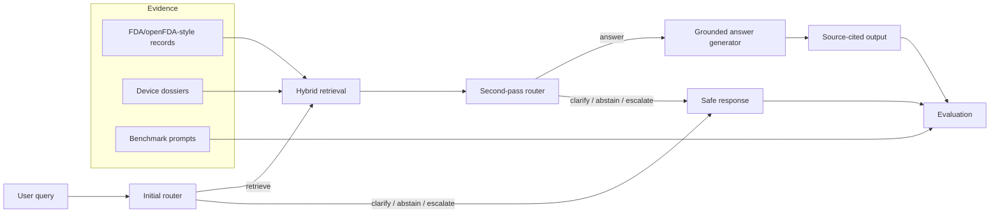

# RouteGuard-Med

**LLM-agent routing and evaluation for regulated medical-AI governance.**

RouteGuard-Med extends AIMD Sentinel from static regulatory dossiers into an **agent-evaluation platform**. Given a user query or regulatory/clinical question, the system routes to exactly one of five actions:

| Action | When the system should choose it |
|---|---|
| **Answer** | Enough source evidence is already available and the question is low-risk. |
| **Retrieve** | The question may be answerable, but source evidence must be retrieved first. |
| **Clarify** | The query is ambiguous, missing a device/manufacturer/version, or underspecified. |
| **Abstain** | The question asks for unsupported causal, incidence, or unverifiable claims. |
| **Escalate** | Human review is needed due to clinical advice, legal causality, prompt injection, or high-risk uncertainty. |

This directly turns AIMD Sentinel into a **regulated LLM-agent evaluation project**: retrieval, routing, source grounding, hallucination control, abstention, clarification, escalation, cost-aware utility, and evaluation.

---

## Why this matters

Most LLM demos answer everything. Regulated medical AI systems should not. They need to know when to retrieve evidence, when to ask clarifying questions, when to abstain, and when to escalate to human review.

RouteGuard-Med evaluates this behavior explicitly.

---

## Architecture



---

## Included components

| Component | Files |
|---|---|
| Data layer | `routeguard_med/data_layer.py`, `routeguard_med/data/sample_evidence.jsonl`, `routeguard_med/benchmarks/routeguard_med_300.csv` |
| Retrieval | `routeguard_med/retrieval/bm25.py`, `dense.py`, `hybrid.py` |
| Routers | `routeguard_med/routers/heuristic.py`, `utility.py`, `learned.py`, `llm_router.py` |
| Local/open model support | `routeguard_med/models/clients.py` |
| Agent pipeline | `routeguard_med/agent.py`, `generation.py` |
| Evaluation | `routeguard_med/evaluation/evaluate.py`, `metrics.py` |
| API/frontend | `routeguard_med/api/main.py`, `routeguard_med/frontend/streamlit_app.py` |
| Deployment | `docker-compose.routeguard.yml`, `.env.routeguard.example` |

---

## How to run in 10 minutes

```bash
git clone https://github.com/luke2997/aimd-sentinel.git
cd aimd-sentinel

# Copy/add this RouteGuard-Med patch if not already merged.
python -m venv .venv
source .venv/bin/activate
pip install -r requirements.txt -r routeguard_med/requirements-routeguard.txt
```

Run one query:

```bash
python -m routeguard_med.cli route \
  --query "What public evidence exists for UNiD Spine Analyzer software anomalies?" \
  --router utility
```

Run the evaluation benchmark:

```bash
python -m routeguard_med.evaluation.evaluate \
  --benchmark routeguard_med/benchmarks/routeguard_med_300.csv \
  --corpus routeguard_med/data/sample_evidence.jsonl \
  --routers heuristic,utility,learned \
  --out-dir routeguard_reports
```

Open the leaderboard:

```bash
cat routeguard_reports/evaluation_report.md
```

Run FastAPI + Streamlit:

```bash
docker compose -f docker-compose.routeguard.yml up
```

Then open:

- API: `http://localhost:8008/docs`
- UI: `http://localhost:8501`

---

## Evaluation metrics

RouteGuard-Med reports:

| Metric | Meaning |
|---|---|
| Accuracy | Whether the router chose the expected action. |
| Citation precision | Whether cited source IDs are retrieved/gold evidence. |
| Unsupported-claim rate | Whether generated answers contain factual claims without source markers. |
| Correct abstain | Recall/quality for abstention cases. |
| Correct clarify | Recall/quality for ambiguous cases. |
| Retrieval usefulness | Whether retrieved evidence intersects the labelled gold sources. |
| Cost/query | Approximate token/retrieval cost proxy. |
| Net utility | Expected utility of the chosen action under labelled utility/cost values. |
| Latency | Average runtime per query. |
| Failure modes | Wrong action, missed retrieval, unsupported claim, etc. |

Example leaderboard format:

| Router | Accuracy | Unsupported claims | Correct abstain | Correct clarify | Cost/query | Net utility |
|---|---:|---:|---:|---:|---:|---:|
| value_aligned_utility | 0.82 | 0.00 | 0.76 | 0.81 | 0.21 | 2.14 |
| learned_tfidf_logreg | 0.77 | 0.00 | 0.70 | 0.75 | 0.19 | 1.88 |
| heuristic | 0.71 | 0.00 | 0.69 | 0.63 | 0.17 | 1.62 |

Your actual numbers will be generated by `routeguard_reports/leaderboard.csv`.

---

## Router designs

### 1. Heuristic router

Rule-based baseline for reproducibility and safety testing.

### 2. LLM-as-router

Uses a JSON-only prompt to choose one of the five actions. Supports OpenAI or OpenAI-compatible APIs. The public offline evaluation does not require this.

### 3. Learned router

A lightweight TF-IDF + logistic regression classifier trained on the benchmark. This can be upgraded to bge-m3 embeddings or a small transformer classifier.

### 4. Value-aligned utility router

Explicitly optimizes expected utility under:

- answer reward,
- retrieval cost,
- clarification cost,
- abstention cost,
- escalation cost,
- unsupported-claim penalty,
- risk score,
- ambiguity score,
- evidence score.

This is the most theory-aligned router.

---

## Local/open model support

`routeguard_med/models/clients.py` supports:

- OpenAI API,
- OpenAI-compatible gateways for models such as Qwen, DeepSeek, GLM, or MiniMax where available,
- Ollama local models such as `qwen2.5:3b` or `deepseek-r1:1.5b`.

Example Ollama setup:

```bash
ollama pull qwen2.5:3b
export OLLAMA_MODEL=qwen2.5:3b
```

Then route with an LLM router by instantiating `LLMRouter(OllamaClient(...))` in an experiment script.

---

## Chinese summary / 中文简介

**RouteGuard-Med 是一个面向医疗 AI 治理的大模型智能体路由与评测系统。**

系统根据用户问题在五个动作中选择：

- Answer：直接回答
- Retrieve：检索证据
- Clarify：要求澄清
- Abstain：拒答 / 不足以回答
- Escalate：升级人工审核

核心方向：

- 医疗 AI 治理
- RAG 评测
- 幻觉控制
- 证据溯源
- 安全评估
- 大模型智能体路由
- 本地 / 开源模型部署接口

---

## CV bullets

- Built RouteGuard-Med, a production-style LLM-agent routing and evaluation system for regulated medical-AI governance, choosing among answer, retrieve, clarify, abstain, and human escalation under explicit utility, latency, and hallucination costs.
- Benchmarked heuristic, LLM-as-router, learned, and value-aligned routers across public FDA/openFDA-style records and ambiguous QA prompts, measuring unsupported-claim rate, citation precision, abstention quality, clarification quality, retrieval cost, and net utility.
- Deployed a Dockerized FastAPI/Streamlit/RAG stack with hybrid retrieval, source-grounded generation, adversarial prompt tests, local/open-model support, and reproducible evaluation reports.

---

## Limitations

RouteGuard-Med is a research/prototype evaluation system. It does not provide medical advice, determine causality, estimate adverse-event incidence, or replace regulatory/legal/clinical review.
