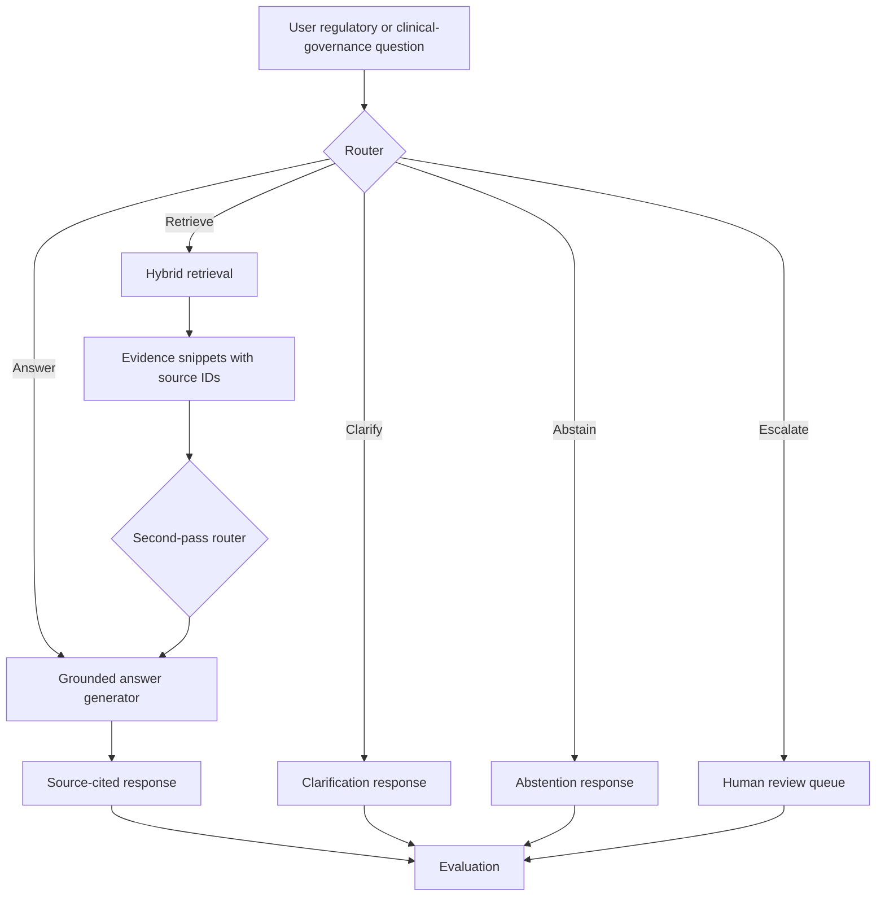

# RouteGuard-Med architecture

RouteGuard-Med adds an agent-routing and evaluation layer to AIMD Sentinel.

## Five-action routing policy

| Action | Regulated AI meaning |
|---|---|
| Answer | Evidence is sufficient and the query is low-risk. |
| Retrieve | Evidence is needed before a grounded answer. |
| Clarify | Device/manufacturer/version or intent is missing. |
| Abstain | Public evidence cannot support the requested claim. |
| Escalate | Human review required due to clinical, legal, safety, or adversarial risk. |

## Evidence rule

Generated factual claims should be tied to retrieved source IDs. Weak matches are treated as review-only.
